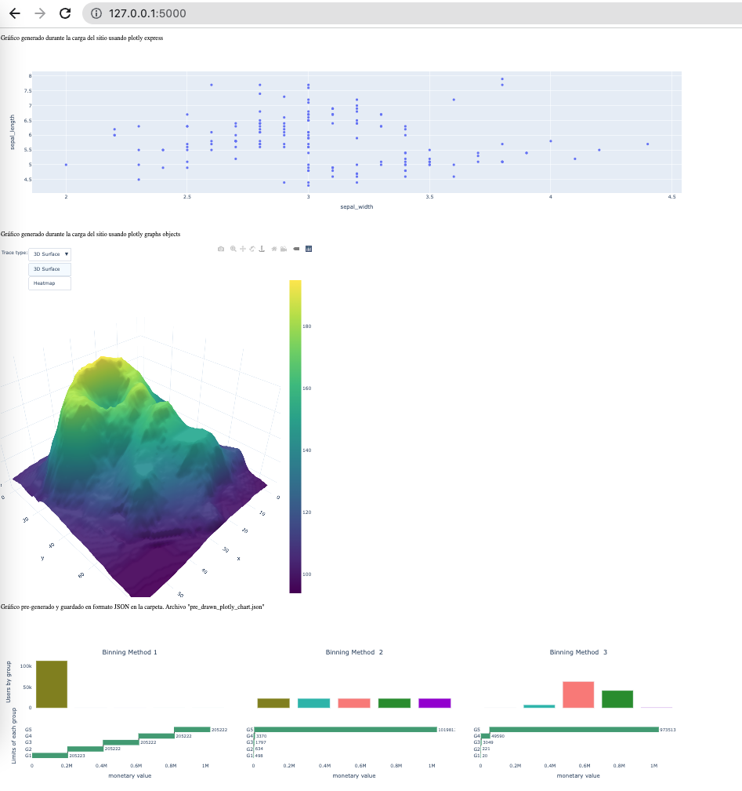

# Breve investigación: cómo insertar plotly en una app de flask

## Vista de ejemplo:



## Descripción

Esta app muestra tres gráfico hechos con Plotly que pueden ser renderizados en HTML sin mucho esfuerzo. Permite trabajar con gráficos en un entorno más conocido y luego llevar esos mismos gráficos a producción usando flask. 

En el archivo `app.py` se generan 3 gráficos con plotly:

* El primero es un scatter plot que se generó usando `Plotly express`
* El segundo es un heatmap plot o surface plot que se generó usando `Plotly Graph Objects` y tiene más features, como por ejemplo menus desplegables.
* El tercero es un gráfico que se construyó para el BADS-PRODS de Clustering, y fue guardado en formato JSON y sólamente es mostrado en la página (no se genera en tiempo real, ya se generó y solo se muestra).

### Cómo funciona:
* Paso 0: generar los gráficos como siempre en un notebook usando plotly, por ejemplo:

```Python
    df = px.data.iris() # Load iris (it is a pandas DataFrame)
    fig1 = px.scatter(df, x="sepal_width", y="sepal_length") # Build the figure
    fig1.show() # Show the figure
```
* Paso 1: en la app de flask importar `from plotly.utils import PlotlyJSONEncoder`
* Paso 2: En lugar de usar el método `fig1.show()` usaremos el método  `json.dump()` para convertir nuestro gráfico en un formato json. Para eso usamos el encoder de plotly que importamos. Quedaría:

```Python
    df = px.data.iris() # Load iris (it is a pandas DataFrame)
    fig1 = px.scatter(df, x="sepal_width", y="sepal_length") # Build the figure
    graph1JSON = json.dumps(fig1, cls=PlotlyJSONEncoder)  # Guardamos la figura en formato JSON dentro de la variable `graph1JSON`
```

* Paso 3: enviamos el JSON desde Flask al navegador. La forma de hacerlo es usando el método `render_template` de Flask. Hay una plantilla cargada en html y en esa plantilla podemos insertar variables o argumentos. En nuestro caso pasaremos como variables el/los gráfico/s:

``` python
   # En el return de la función usamos render_template y pasamos los objetos json como argumentos.
    return render_template(
                "layout.html", # Nombre de la plantilla html
                graph1JSON = graph1JSON, # pasamos la variable que buscamos. Puede tener cualquier nombre y no hay que declararlas antes.
    )
```
* Paso 4: Hay que preparar la template html para recibir los gráficos en formato JSON.
* Dentro del `<body>` generamos tantas  divisiones como gráficos haya (usando la etiqueta `<div>` ) y le asignamos un nombre, por ejemplo `"chart1"`

```html
<body>
    <div id = "chart1"></div>
</body>
```

* También dentro del body, debemos agregar un pequeño código en javascript, que básicamente se encarga de descodificar el JSON y renderizarlo en el navegador. 
  
```html
<script src="https://cdn.plot.ly/plotly-latest.min.js"></script>
<script>
    var graphs1 = {{ graph1JSON | safe}};
    Plotly.plot("chart1", graphs1,{});
</script>
```
* La primer linea con la URL es la "librería" que se encarga de hacer todo. 
* Luego se crea una variable que llamamos `graph` y se la inicializa con el valor `{{ graph1JSON | safe }}`. graph1JSON es el nombre de la variable que esta pasando flask. Al hacer eso, la variable `graphs1` dentro del archivo html contendrá el json que le envió flask.
* Luego se ejecuta el comando `Plotly.plot("chart1", graphs1,{});`. Plotly.plot es lo que importamos desde la url en la primer línea, `chart1` es el nombre del `<div>` que creamos (donde se va a posicionar la figura) y `graphs1` es la variable en formato JSON.
  
## Detalle interesante:
El tercer gráfico está ya guardado en formato json, dentro del archivo `pre_drawn_plotly_chart.json`. Lo único que se hace dentro de la app escargar el json y renderizarlo. Esto puede ser alo útil para generar los gráficos en el backend asincrónicamente, guardarlos en un bucket de gpc y sólamente levantarlos y  mostrarlos cuando el usuario entra el sitio.
